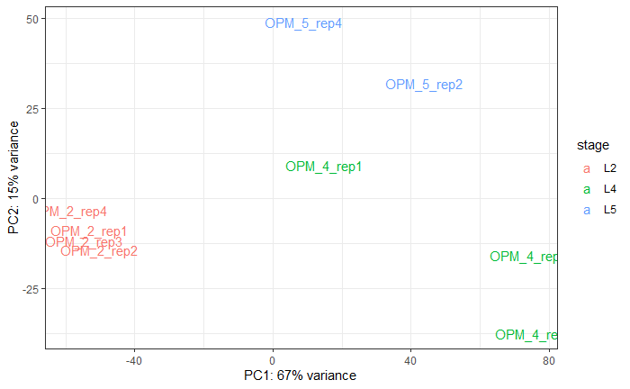

Pipeline of the *de novo* transcriptome assembly of three larval stages of the oak processionary moth (OPM) (*Thaumetopoea processionea*).


# Objective

*Thaumetopoea processionea* moths cause health problem due to their urticant hairs [(Rahlenbeck 2015)](https://www.ncbi.nlm.nih.gov/pmc/articles/PMC4513735/). The group of [Prof. Dr. med. Timo Buhl](https://hautklinik.umg.eu/forschung/arbeitsgruppen/prof-dr-med-timo-buhl-allergy-and-clinical-immunology/) want to identify candidate allergens that start being produced from larvae stage L3. Therefore, transcriptomic data are needed at larval stages before and after this transition to toxicity. 


# Experimental design

Larvae of *Thaumetopoea processionea* were all collected from a single nest in an English oak tree (*Quercus robur*) in Briesener Zootzen (Germany, 52.755167N, 12.674806E), in May 14, 2022 (L2 and L4 stages) and June 15, 2022 (L5 stage). The larvae were then brought to the laboratory, snap frozen in liquid nitrogen, and stored at -80&deg;C. Larvae were homogenized with mortar and pestle in liquid nitrogen and 20 mg of tissue was used for total RNA extraction with the Quick-RNAT Tissue/Insect Microprep kit (Zymo, R2030). Eleven RNA-seq libraries (4 x L2 larvae, 4 x L4 larvae, 3 x L5 larvae) were prepared with the NEBNext Ultra II Directional RNA Library Prep Kit for Illumina (NEB E7760L) kit. Paired-end sequencing (100+100 bp) was performed on the 11 pooled libraries on the MGISEQ-2000 (BGI) to obtain about 30-55 million reads per library.


# Data

The data contain 3 stages (L2, L4, L5) with at least 3 biological replicates, 11 samples in total. Data are available on NCBI BioProject PRJNA1072613.

Summary from fastqc and multiqc on the 22 raw fastq files:

| Sample Name  | % Dups | % GC | M Seqs |
|--------------|--------|------|--------|
| OPM_2_1_L1_1 |  74.3% |  45% |  48.2  |
| OPM_2_1_L1_2 |  78.4% |  45% |  48.2  |
| OPM_2_2_L1_1 |  72.1% |  45% |  38.3  |
| OPM_2_2_L1_2 |  75.5% |  45% |  38.3  |
| OPM_2_3_L1_1 |  70.0% |  45% |  42.0  |
| OPM_2_3_L1_2 |  74.6% |  45% |  42.0  |
| OPM_2_4_L1_1 |  72.1% |  45% |  46.6  |
| OPM_2_4_L1_2 |  75.8% |  45% |  46.6  |
| OPM_4_1_L1_1 |  80.2% |  46% |  54.8  |
| OPM_4_1_L1_2 |  84.4% |  46% |  54.8  |
| OPM_4_2_L1_1 |  87.0% |  51% |  30.8  |
| OPM_4_2_L1_2 |  89.2% |  51% |  30.8  |
| OPM_4_3_L1_1 |  83.2% |  49% |  41.6  |
| OPM_4_3_L1_2 |  86.0% |  49% |  41.6  |
| OPM_4_4_L1_1 |  84.4% |  49% |  44.0  |
| OPM_4_4_L1_2 |  87.1% |  49% |  44.0  |
| OPM_5_1_L1_1 |  84.9% |  49% |  44.0  |
| OPM_5_1_L1_2 |  87.5% |  49% |  44.0  |
| OPM_5_2_L1_1 |  84.4% |  49% |  48.5  |
| OPM_5_2_L1_2 |  86.9% |  49% |  48.5  |
| OPM_5_4_L1_1 |  83.0% |  49% |  47.3  |
| OPM_5_4_L1_2 |  86.2% |  49% |  47.3  |


# Read processing

https://informatics.fas.harvard.edu/best-practices-for-de-novo-transcriptome-assembly-with-trinity.html
https://github.com/harvardinformatics/TranscriptomeAssemblyTools

1. Examine quality metrics (fastqc)
2. Remove erroneous k-mers from reads with perl script [Rcorrector](https://github.com/mourisl/Rcorrector) 
3. Discard read pairs for which one of the reads is deemed unfixable with python parser [script](https://github.com/harvardinformatics/TranscriptomeAssemblyTools/blob/master/FilterUncorrectabledPEfastq.py)
4. Trim adapter and low quality bases from fastq files

More general good practices https://genomebiology.biomedcentral.com/articles/10.1186/s13059-016-0881-8#Sec3

The script here is give for one sample (OPM_2_1_L1_1) to illustrate the name changes taking place at each step. OPM_2_1_L1_1.fq.gz contains the read 1 and OPM_2_1_L1_2.fq.gz contains read 2.

## Remove rare kmers with Rcorrector

```{bash, eval=FALSE}

git clone https://github.com/mourisl/rcorrector.git
cd rcorrector
make

perl run_rcorrector.pl -t 12 -1 OPM_2_1_L1_1.fq.gz -2 OPM_2_1_L1_2.fq.gz

```

Output files will be `OPM_2_1_L1_1.cor.fq.gz` and `OPM_2_1_L1_2.cor.fq.gz`.

## Discard unfixable read pairs

Discard read pairs for which one of the reads is deemed unfixable with a python script from https://github.com/harvardinformatics/TranscriptomeAssemblyTools#filteruncorrectablepefastqpy

```{bash, eval=FALSE}

git clone https://github.com/harvardinformatics/TranscriptomeAssemblyTools.git

python2 TranscriptomeAssemblyTools/FilterUncorrectabledPEfastq.py \
  -1 OPM_2_1_L1_1.cor.fq \
  -2 OPM_2_1_L1_2.cor.fq \
  -s OPM_2_1_L1

```

Output files will be `unfixrm_OPM_2_1_L1_1.cor.fq` and `unfixrm_OPM_2_1_L1_2.cor.fq`.

## Trimming

Remove 3' adapters from read 1 and read 2 and trim by quality, allowing no Ns.

```{bash, eval=FALSE}
cutadapt -a AGATCGGAAGAGCACACGTCTGAACTCCAGTCA -A AGATCGGAAGAGCGTCGTGTAGGGAAAGAGTGT \
  --quality-base 33 --max-n 0  -o unfixrm_OPM_2_1_L1_1.trimmed.fastq.gz \
    -p unfixrm_OPM_2_1_L1_2.trimmed.fastq.gz unfixrm_OPM_2_1_L1_1.cor.fq \
    unfixrm_OPM_2_1_L1_2.cor.fq
```

Output files will be `unfixrm_OPM_2_1_L1_1.trimmed.fastq.gz` and 
`unfixrm_OPM_2_1_L1_2.trimmed.fastq.gz`.

## Remove rRNA

Download the sequences as fasta files without gaps rRNA sequence from Lepidoptera as taxonomy (1068 hits for SSU and 40 hits for LSU) (https://www.arb-silva.de).

```{bash, eval=FALSE}

cat arb-silva.de_2023-03-22_id1242715_tax_silva_SSU.fasta \ 
  arb-silva.de_2023-03-22_id1242716_tax_silva_LSU.fasta > LSU_SSU.fa

bowtie2-build -f LSU_SSU.fa LSU_SSU

bowtie2 --nofw --quiet --very-sensitive-local --phred33  \
    -x LSU_SSU -1 unfixrm_OPM_2_1_L1_1.trimmed.fastq.gz \
    -2 unfixrm_OPM_2_1_L1_2.trimmed.fastq.gz. \
    --un-conc-gz unfixrm_OPM_2_1_L1.rRNA_removed.fq.gz > /dev/null

```

Output files will be `unfixrm_OPM_2_1_L1_rRNA_removed.fq.1.gz` and 
`unfixrm_OPM_2_1_L1_2.rRNA_removed.fq.2.gz`.


## Remove remaining over-represented sequences

```{bash, eval=FALSE}
python2 TranscriptomeAssemblyTools/RemoveFastqcOverrepSequenceReads.py \
      -1 unfixrm_OPM_2_1_L1_rRNA_removed.fq.1.gz \
      -2 unfixrm_OPM_2_1_L1_2.rRNA_removed.fq.2.gz \
      -fql rRNA_removed.1.fastqc \
      -fqr rRNA_removed.2.fastqc

```

## Replace empty reads

Cutadapt has removed some read and quality sequences but let the headers to allow complete pairing between the two fastq files. However, this causes a exit failure in the seqtk part of Trinity (conversion of fastq to fasta format). I looked around and found the simplest fix in https://github.com/lh3/seqtk/issues/3, where empty lines are replaced with one N.

```{bash, eval=FALSE}

perl -i -p -e 's/^$/N/g;' rmoverrep_unfixrm_OPM_2_1_L1_1.rRNA_removed.1.fq
perl -i -p -e 's/^$/N/g;' rmoverrep_unfixrm_OPM_2_1_L1_2.rRNA_removed.2.fq

```

# De novo transcriptome assembly

## Pool all data

```{bash, eval=FALSE}
cat *.1.fq > reads.ALL.1.fq
cat *.2.fq > reads.ALL.2.fq
```

## Run Trinity

Download [last version](https://github.com/trinityrnaseq/trinityrnaseq/releases) of Trinity and install it. 

```{bash, eval=FALSE}
tar -xzvf trinityrnaseq-v2.15.1.FULL.tar.gz

cd trinityrnaseq-v2.15.1

module load cmake

make

```

Dependencies of Trinity were pre-installed on our HPC and loaded using [Module](https://modules.readthedocs.io/en/latest/index.html)

```{bash, eval=FALSE}

module load samtools python/3.9.0 openjdk/17.0.0_35 \
  salmon/0.10.2 bowtie/2.3.4.1 jellyfish/2.2.10 samtools/1.12

Trinity \
      --seqType fq \
      --max_memory 100G \
      --left reads.ALL.1.fq \
      --right reads.ALL.2.fq \
      --SS_lib_type RF \
      --output trinity_out_dir \
      --CPU 8 \

```

Time needed on our HPC with 8 cores and 100 Gb of RAM: 2045 min (34 hours). The output is `Trinity.fasta`.


Summary of the Trinity run:

```{bash, eval=FALSE}

$TRINITY_HOME/util/TrinityStats.pl  Trinity.fasta

```

```
################################
## Counts of transcripts, etc.
################################
Total trinity 'genes':  160417
Total trinity transcripts:      216476
Percent GC: 41.56

########################################
Stats based on ALL transcript contigs:
########################################

        Contig N10: 5438
        Contig N20: 3611
        Contig N30: 2644
        Contig N40: 1997
        Contig N50: 1522

        Median contig length: 413
        Average contig: 836.07
        Total assembled bases: 180989306
```


# ORF prediction

Open reading frames and peptide sequences are predicted using [TransDecoder](https://github.com/TransDecoder/TransDecoder/wiki). The minimum peptide length is set by default to 100 amino acids.

```{bash, eval=FALSE}

wget https://github.com/TransDecoder/TransDecoder/archive/refs/tags/TransDecoder-v5.7.0.tar.gz

tar -zxvf  TransDecoder-v5.7.0.tar.gz

```

## Step 1: extract the long open reading frames

```{bash, eval=FALSE}
~/bin/TransDecoder-TransDecoder-v5.7.0/TransDecoder.LongOrfs -t Trinity.fasta \
      --output_dir $output_folder
```


## Step 2: predict the likely coding regions

```{bash, eval=FALSE}
~/bin/TransDecoder-TransDecoder-v5.7.0/TransDecoder.Predict -t Trinity.fasta \
    --output_dir $output_folder
```

Transdecoder provides four output files (`Trinity.fasta.transdecoder.bed`, `Trinity.fasta.transdecoder.cds`, `Trinity.fasta.transdecoder.gff3`, and `Trinity.fasta.transdecoder.pep`) that the transcript and peptide sequences and annotations.

```{bash, eval=FALSE}
seqkit stats Trinity.fasta.transdecoder.pep
file    format  type     num_seqs     sum_len  min_len  avg_len  max_len
Trinity.fasta.transdecoder.pep  FASTA   Protein    78,662  26,077,223       85    331.5   20,578
```

`Trinity.fasta.transdecoder.pep` contains 78,662 peptides between 85 and 20,578 amino acids in length.


# BUSCO completedness analysis

To avoid redundancies between transcripts, perform BUSCO on the longest isoform of each assembled gene.

```{bash, eval=FALSE}

perl $TRINITY_HOME/util/misc/get_longest_isoform_seq_per_trinity_gene.pl \
  Trinity.fasta > Trinity_longest_isoform.fasta

module load busco/5.4.3

busco -i Trinity_longest_isoform.fasta -m transcriptome \
  --lineage_dataset lepidoptera_odb10 --cpu 8 --out busco_output

cat busco_output/short_summary.specific.lepidoptera_odb10.busco_OPM_longest_isoform.txt

```


```
# BUSCO version is: 5.4.3
# The lineage dataset is: lepidoptera_odb10 (Creation date: 2024-01-08, number of genomes: 16, number of BUSCOs: 5286)
# Summarized benchmarking in BUSCO notation for file \
# /scratch1/users/zicola/Thaumetopoea_processionea_transcriptome/Trinity_longest_isoform.fasta
# BUSCO was run in mode: euk_tran

        ***** Results: *****

        C:89.3%[S:84.9%,D:4.4%],F:1.8%,M:8.9%,n:5286
        4724    Complete BUSCOs (C)
        4490    Complete and single-copy BUSCOs (S)
        234     Complete and duplicated BUSCOs (D)
        93      Fragmented BUSCOs (F)
        469     Missing BUSCOs (M)
        5286    Total BUSCO groups searched

Dependencies and versions:
        hmmsearch: 3.1
        metaeuk: 6.a5d39d9
        busco: 5.4.3

```


Job finished in 1045 seconds.


# Trinotate annotation

See Trinotate [documentation](https://github.com/Trinotate/Trinotate/wiki) and [tutorial](https://rnabio.org/module-07-trinotate/0007/02/01/Trinotate/).

## Install Trinotate and dependencies

```{bash, eval=FALSE}
# Download last Trinotate version (4.0.1) on https://github.com/Trinotate/Trinotate/releases
cd  ~
tar -xvf Trinotate-Trinotate-v4.0.1.tar.gz

```

### Infernal

```{bash, eval=FALSE}

# Download infernal (cmpress utility)  http://eddylab.org/infernal/ 
# (see https://www.biostars.org/p/9569120/#9569121)
tar -xvf infernal-1.1.4.tar.gz
cd infernal-1.1.4-
./configure
make
make check
./configure --prefix /usr/users/zicola/bin/infernal-1.1.4

# Add to .bashrc
export PATH="${PATH}:/usr/users/zicola/bin/infernal-1.1.4/src"

```


### Diamond

Faster alternative to blast

```{bash, eval=FALSE}
# Download diamond (https://github.com/bbuchfink/diamond/wiki)
cd ~/bin
wget http://github.com/bbuchfink/diamond/releases/download/v2.1.8/diamond-linux64.tar.gz
tar xzf diamond-linux64.tar.gz
```

### Sqlite3

```{bash, eval=FALSE}
# sqlite is already installed
sqlite3 --help
```

### HMMER

Already preinstalled in Modules

```{bash, eval=FALSE}
# Load dependency (hmmpress)
module load hmmer/3.3
```

### SignalP6

Download signalP6 (need to give email address) on https://services.healthtech.dtu.dk/services/SignalP-6.0/

Follow instructions in https://github.com/fteufel/signalp-6.0/blob/main/installation_instructions.md

```{bash, eval=FALSE}
tar xvf signalp-6.0h.fast.tar.gz

cd signalp6_fast

pip install signalp-6-package/

SIGNALP_DIR=$(python3 -c "import signalp; import os; print(os.path.dirname(signalp.__file__))" )
cp -r signalp-6-package/models/* $SIGNALP_DIR/model_weights/

```


### TMHMM

Download TMHMM 2.0 for Linux (https://services.healthtech.dtu.dk)

```{bash, eval=FALSE}

cd /usr/users/zicola/bin/tmhmm-2.0c/bin

# Change shebang in tmhmm and tmhmmformat.pl perl 
# script and use `/usr/bin/perl`

#Then, edit line 33 of tmhmm:
   #$opt_basedir = "/usr/cbs/packages/tmhmm/2.0c/tmhmm-2.0c/";
as:
   $opt_basedir = "/usr/users/zicola/bin/tmhmm-2.0c/"

#removing the comment '#' and setting the path to the 
# directory where you installed the software.

# Add this to .bashrc
export PATH="${PATH}:/usr/users/zicola/bin/tmhmm-2.0c/bin"

```


## Run Trinotate

```{bash, eval=FALSE}

# Modules to load
module load gcc
module load hmmer/3.3


# Test that all programs needed are installed
test_program(){
  command -v $1 >/dev/null || \
    { echo >&2 " $1 required but not installed. Aborting"; exit 1; }
}

test_program "diamond"
test_program "cmpress"
test_program "hmmpress"
test_program "tmhmm"
test_program "signalp6"


# Variables
TRINOTATE_HOME="/path/to/Trinotate-Trinotate-v4.0.1"

sqlite_db="/path/to/Trinotate-Trinotate-v4.0.1/Trinotate_OPM.sqlite"

# Output from Trinity
gene_trans_map="/path/to/Trinity.fasta.gene_trans_map"

transcript_fasta="path/to/Trinity.fasta"

# Output from Transdecoder
transdecoder_pep_file="/path/to/Trinity.fasta.transdecoder.pep"


echo "############################"
echo "Trinotate create"
date
echo "############################"

$TRINOTATE_HOME/Trinotate --create \
                          --db $sqlite_db \
                          --trinotate_data_dir $TRINOTATE_HOME/TRINOTATE_DATA_DIR \
                          --use_diamond

echo "###############################"
echo "Trinotate Init"
date
echo "###############################"


$TRINOTATE_HOME/Trinotate --db $sqlite_db --init \
           --gene_trans_map $gene_trans_map \
           --transcript_fasta $transcript_fasta \
           --transdecoder_pep $transdecoder_pep_file

echo "##############################"
echo  "Trinotate Run"
date
echo "##############################"
 
$TRINOTATE_HOME/Trinotate --db ${sqlite_db} --run ALL \
  --trinotate_data_dir $TRINOTATE_HOME/TRINOTATE_DATA_DIR \
    --transcript_fasta $transcript_fasta \
      --transdecoder_pep $transdecoder_pep_file \
      --use_diamond

echo "###########################"
echo "Generating report table"
date
echo "###########################"

$TRINOTATE_HOME/Trinotate --db ${sqlite_db} \
  --report --incl_pep --incl_trans > Trinotate_report.tsv

##################
## Misc value adds
##################

# Extract GO terms
${TRINOTATE_HOME}/util/extract_GO_assignments_from_Trinotate_xls.pl \
  --Trinotate_xls Trinotate_report.tsv -G -I > Trinotate_report.tsv.gene_ontology

# Generate trinotate report summary statistics
${TRINOTATE_HOME}/util/report_summary/trinotate_report_summary.pl \
  Trinotate_report.tsv Trinotate_report_stats

echo "##########################"
echo "done.  See annotation summary file:  Trinotate_report.tsv"
date
echo "##########################"

```

Job took 2311 minutes (38.5 hours).


# RNA-seq analysis

## Samples file

Create a sample file Excel file as follow for Salmon processing containing as column stage, replicate, left read fastq file name, right read fastq file name. Copy the columns without headers in the file [samples_file.txt](data/samples_file.txt). This file be provided for the flag `--samples_file` for the command `align_and_estimate_abundance.pl`.

## Estimating Transcript Abundance

See Trinity [tutorial](https://github.com/trinityrnaseq/trinityrnaseq/wiki/Trinity-Transcript-Quantification) for more information.

### Salmon index

Build an salmon index (see https://combine-lab.github.io/salmon/getting_started/)

```{bash, eval=FALSE}

module load salmon/0.10.2

salmon index -t Trinity.fasta -i Trinity.fasta.salmon.idx

```

### align and estimate abundance

```{bash, eval=FALSE}

module load samtools python/3.9.0 openjdk/17.0.0_35 salmon/0.10.2 \
  bowtie/2.3.4.1 jellyfish/2.2.10 samtools/1.12

perl $TRINITY_HOME/util/align_and_estimate_abundance.pl \
          --transcripts Trinity.fasta \
          --seqType fq \
          --samples_file samples_file.txt \
          --gene_trans_map Trinity.fasta.gene_trans_map \
          --est_method salmon \
          --SS_lib_type RF \
          --thread_count 12

```

For each sample, I get two files:

```
quant.sf : transcript abundance estimates (generated by salmon)
quant.sf.genes : gene-level abundance estimates (generated here by summing transcript values)
```

These files can be imported in DESeq2 for expression analysis.

## DESeq2 analysis

Example of tutorial on http://sthda.com/english/wiki/rna-seq-differential-expression-work-flow-using-deseq2

### R libraries

```{r, eval=FALSE, echo=FALSE, warning=FALSE}
library("tidyverse")
library("ggplot2")
library("DESeq2")
library("tximport")
```


### Coldata

Create a `coldata` text file. First column should contain the sample name as in the count matrix. The second column contain the larval stage, and the third the toxicity status.

| sample     | stage | toxicity |
|------------|-------|----------|
| OMP_2_rep1 | L2    | nontoxic |
| OMP_2_rep2 | L2    | nontoxic |
| OMP_2_rep3 | L2    | nontoxic |
| OMP_2_rep4 | L2    | nontoxic |
| OPM_4_rep1 | L4    | toxic    |
| OPM_4_rep2 | L4    | toxic    |
| OPM_4_rep3 | L4    | toxic    |
| OPM_4_rep4 | L4    | toxic    |
| OPM_5_rep1 | L5    | toxic    |
| OPM_5_rep2 | L5    | toxic    |
| OPM_5_rep4 | L5    | toxic    |


### Read count matrix

Import salmon `quant.sf` files with `tximport` package.

This [tutorial](https://bioconductor.org/packages/devel/bioc/vignettes/DESeq2/inst/doc/DESeq2.html#why-un-normalized-counts) recommends to import salmon `quant.sf` files via the [`tximport` function](https://bioconductor.org/packages/release/bioc/html/tximport.html).

Create a tx2gene file (transcript id in 1st column and gene id in second column, header names are not important) it is basically the `Trinity.fasta.gene_trans_map` file but with reversed column position.

```{bash, eval=FALSE}
# Make tx2gene.txt file
awk '{print $2,$1}' Trinity.fasta.gene_trans_map > tx2gene.txt
```

In R: 

```{r, eval=FALSE}

# Upload the coldata file
coldata=read.table ("coldata", header=T)
col_names <- names(coldata)
coldata[,col_names] <- lapply(coldata[,col_names] , factor)
rm(col_names)

# Path to quant.sf files
files <- file.path("expression_analysis", coldata$sample, "quant.sf")
names(files) <- coldata$sample

# Import tx2gene file
tx2gene <- read.table("tx2gene.txt", quote="\"", comment.char="")

# Import salmon data
txi <- tximport(files, type="salmon", tx2gene=tx2gene)

# Create a DESeq2 matrix
dds <- DESeqDataSetFromTximport(txi,
                  colData = coldata,
                  design = ~ toxicity)

```


### PCA vst all samples

```{r, eval=FALSE}

# Variance stabilizing transformation
vsd <- vst(dds, blind=TRUE)

# Create PCA
pcaData <- plotPCA(vsd, intgroup=c("sample", "stage"), returnData=TRUE)

# Get percentage variation
percentVar <- round(100 * attr(pcaData, "percentVar"))

p <- ggplot(pcaData, aes(PC1, PC2, color=stage, label = sample)) +  xlab(paste0("PC1: ",percentVar[1],"% variance")) + ylab(paste0("PC2: ",percentVar[2],"% variance")) +  theme_bw()

p + geom_text(size = 4)

```


The samples OPM_5_rep1 and OPM_4_rep2 are clustering very separately from all the rest. These should be removed in the rest of the analysis.

```{r, eval=FALSE}
dds <- dds[,!colnames(dds) %in% c("OPM_4_rep2","OPM_5_rep1")]
```

### PCA without outliers

We have now 9 samples left.

```{r, eval=FALSE}
# Variance stabilizing transformation
vsd <- vst(dds, blind=TRUE)

# Create PCA
pcaData <- plotPCA(vsd, intgroup=c("sample", "stage"), returnData=TRUE)

# Get percentage variation
percentVar <- round(100 * attr(pcaData, "percentVar"))

p <- ggplot(pcaData, aes(PC1, PC2, color=stage, label = sample)) +  xlab(paste0("PC1: ",percentVar[1],"% variance")) + ylab(paste0("PC2: ",percentVar[2],"% variance")) +  theme_bw()

p + geom_text(size = 4)
```



The samples cluster separately depending on their stage, with the stage L2 (red) individuals being the closest.


```{r}
# Create PCA
pcaData <- plotPCA(vsd, intgroup=c("sample", "toxicity"), returnData=TRUE)

# Get percentage variation
percentVar <- round(100 * attr(pcaData, "percentVar"))

p <- ggplot(pcaData, aes(PC1, PC2, color=toxicity, label = sample)) +  xlab(paste0("PC1: ",percentVar[1],"% variance")) + ylab(paste0("PC2: ",percentVar[2],"% variance")) +  theme_bw()

p + geom_text(size = 4)
```


If we color-code the samples by toxicity, we can clearly see that the non-toxic stage (L2) and the two toxic stages (L4 and L5) cluster separately on the first principal component.


### Read count filtering

Remove all genes with less than 10 reads across all 9 samples.

```{r, eval=FALSE}

keep <- rowSums(counts(dds)) >= 10
dds <- dds[keep,]

```

The filtering kept 73576/160417 genes (45%) after filtering out low expressed genes.


### Pair-wise comparison of larval stages

Compare each stages, using the younger stage as reference.

```{r}

# Remake a deseq object to integrate the change
dds <- DESeq(dds)

# Do pair-wise comparison of the 3 stages. Fix earlier stage as reference
res_L4_vs_L5 <- results(dds, contrast=c("stage","L5","L4"))

res_L5_vs_L2 <- results(dds, contrast=c("stage","L5","L2"))

res_L4_vs_L2 <- results(dds, contrast=c("stage","L4","L2"))

# Retrieve only significant DEGs
df_res_L4_vs_L5 <- as.data.frame(res_L4_vs_L5) %>% rownames_to_column("geneID") %>% filter(padj < 0.05)

df_res_L5_vs_L2 <- as.data.frame(res_L5_vs_L2) %>% rownames_to_column("geneID") %>% filter(padj < 0.05)

df_res_L4_vs_L2 <- as.data.frame(res_L4_vs_L2) %>% rownames_to_column("geneID") %>% filter(padj < 0.05)

# Export as tabulated text files
write.table(df_res_L4_vs_L5, "data/df_res_L4_vs_L5.txt", quote=FALSE, row.names=FALSE, sep="\t")

write.table(df_res_L5_vs_L2, "data/df_res_L5_vs_L2.txt", quote=FALSE, row.names=FALSE, sep="\t")

write.table(df_res_L4_vs_L2, "data/df_res_L4_vs_L2.txt", quote=FALSE, row.names=FALSE, sep="\t")

```


Example of the genes with the lowest p-value for L4 vs L2 comparison: *TRINITY_DN10098_c0_g1*

```{r}
data <- plotCounts(dds, gene="TRINITY_DN10098_c0_g1", intgroup=c("toxicity","stage"), returnData=TRUE)

ggplot(data, aes(x=stage, y=count, color=stage)) +
  scale_y_log10() + 
  geom_point(position=position_jitter(width=.1,height=0), size=3) + theme_bw() + ggtitle("TRINITY_DN10098_c0_g1") + theme(plot.title = element_text(hjust = 0.5))

```


